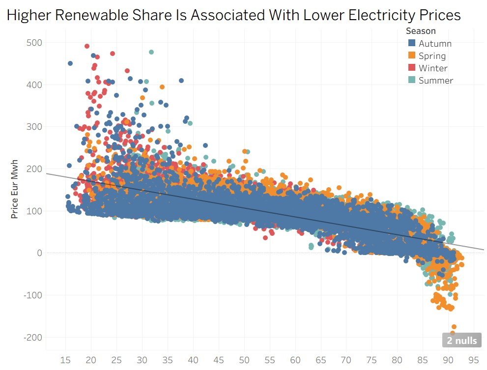
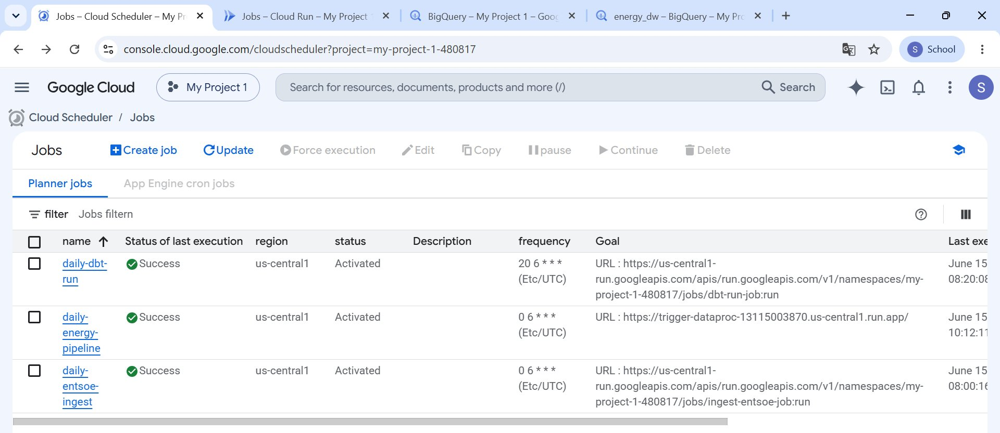
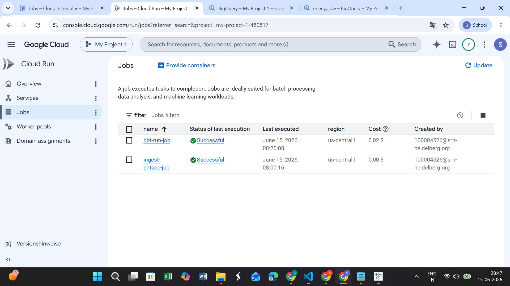
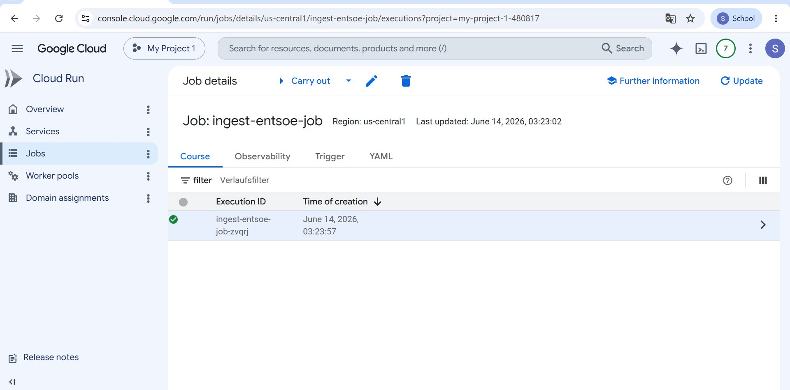
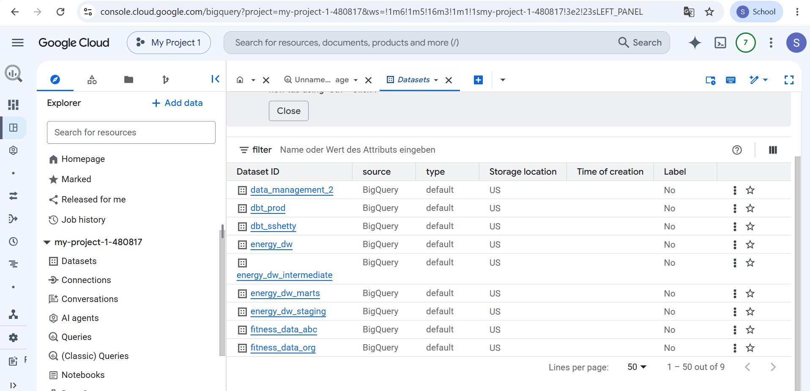
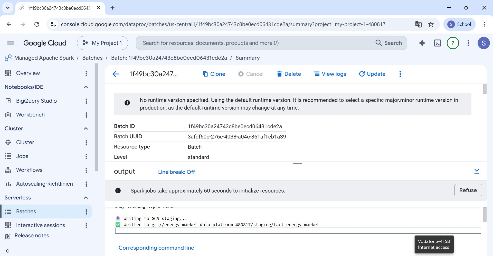
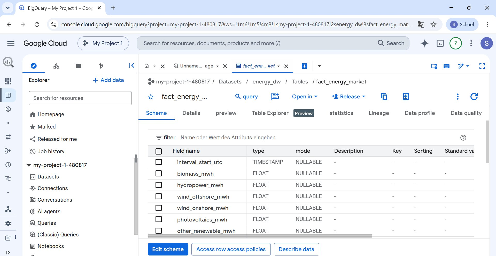
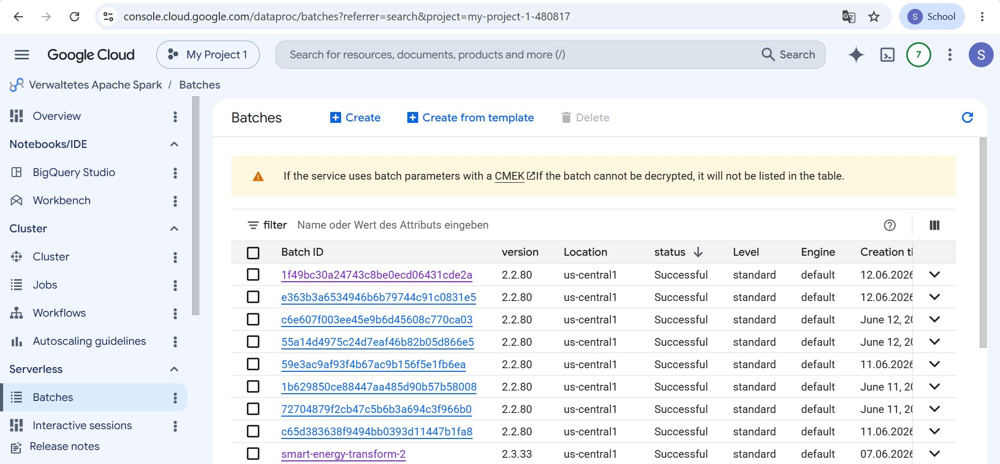
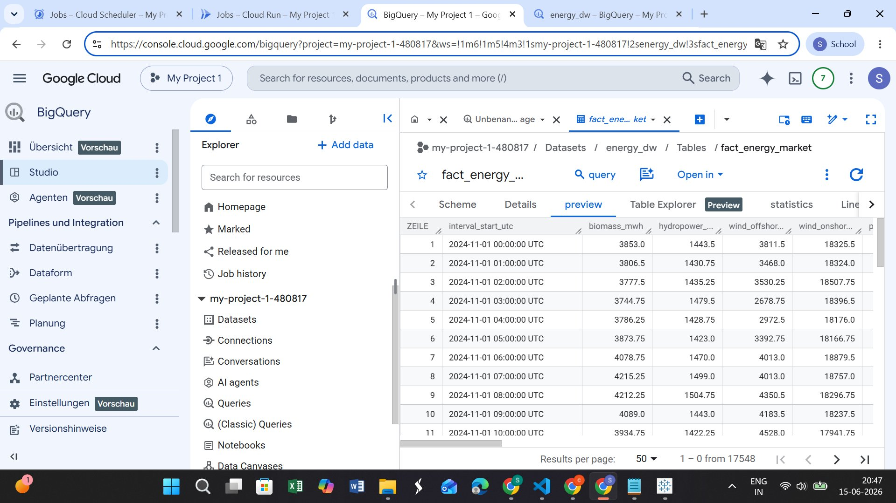
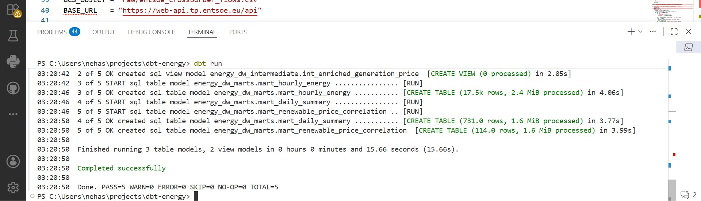

# 🇩🇪 German Electricity Market Analytics Platform

> **Does increasing renewable energy lower electricity prices in Germany?**  
> This pipeline answers that question with 17,548 hours of real market data.

An end-to-end cloud data pipeline analyzing the **merit-order effect** — how growing renewable energy share systematically drives down wholesale electricity prices in Germany.

Built for the Data Management 2 course at **SRH Heidelberg** using GCP, Apache Spark, BigQuery, and dbt.

---

## 📊 Key Findings

| Metric | Result |
|---|---|
| Merit-order R² | **0.59** — renewables explain 59% of price variation |
| Price sensitivity | **−€2.06/MWh** for every 1% increase in renewable share |
| Statistical significance | **p < 0.0001** |
| Seasonal premium | **43% higher prices** in Winter vs. Summer |
| Dataset size | **17,548 hourly observations** |

### Merit-Order Effect — Visualized



*Each point is one hour of the German electricity market. The clear downward trend confirms: the more renewable energy on the grid, the lower the wholesale price. Negative prices (bottom-right) occur when solar/wind supply exceeds demand.*

---

## 🏗️ Pipeline Architecture

```
┌─────────────────────┐     ┌──────────────────────────┐
│   SMARD (Batch)     │     │  ENTSO-E API (Real-time) │
│  Hourly CSV files   │     │  Cross-border flows      │
│  smard.de           │     │  transparency.entsoe.eu  │
└────────┬────────────┘     └────────────┬─────────────┘
         │                               │
         ▼                               ▼
    clean_smard.py              ingest_entsoe.py
         │                               │
         └───────────────┬───────────────┘
                         ▼
            Google Cloud Storage (Raw Layer)
            gs://energy-market-data-platform/raw/
                         │
                         ▼
              spark_transform.py
           (Apache Spark — Dataproc Serverless)
                         │
                         ▼
              BigQuery  —  energy_dw
              fact_energy_market (17,548 rows)
                         │
                         ▼
                    dbt models
           staging → intermediate → marts
                         │
                         ▼
               PowerBI / Tableau
```

---

## 🤖 Automated Pipeline — All 3 Jobs Running Successfully

### Cloud Scheduler — Daily Orchestration



*Three jobs run automatically every day:*

| Job | Schedule (UTC) | Status |
|---|---|---|
| `daily-entsoe-ingest` | 06:00 | ✅ Success |
| `daily-energy-pipeline` | 06:10 | ✅ Success |
| `daily-dbt-run` | 06:20 | ✅ Success |

### Cloud Run Jobs



*`dbt-run-job` and `ingest-entsoe-job` containerized on Cloud Run, triggered daily by Cloud Scheduler.*

### Cloud Run — ENTSO-E Ingest Job Detail



---

## ⚡ Apache Spark — Dataproc Serverless

### Spark Batch Execution History



*Multiple successful Spark batch runs on Dataproc Serverless. Each run joins SMARD generation data, SMARD prices, and ENTSO-E cross-border flows into a unified analytical dataset.*

### Spark Output



*Spark writes the transformed dataset to GCS staging: `gs://energy-market-data-platform-480817/staging/fact_energy_market`*

---

## 🗄️ BigQuery — Data Warehouse

### Dataset Structure



*Four project datasets created by the pipeline:*
- `energy_dw` — raw and source tables
- `energy_dw_staging` — dbt staging layer
- `energy_dw_intermediate` — dbt intermediate layer
- `energy_dw_marts` — final analytical tables consumed by BI tools

### fact_energy_market — Schema



*Core fact table with hourly granularity: `interval_start_utc` as time key, generation by source (biomass, hydropower, wind offshore/onshore, photovoltaics), prices, and cross-border flows.*

### fact_energy_market — Live Data Preview



*17,548 rows of hourly German electricity market data, live and queryable in BigQuery.*

---

## 🔄 dbt Transformations — 5 Models, All Passing



*`dbt run` completes in ~16 seconds, building all 5 models:*

```
staging/
  └── stg_fact_generation_price         → typed view over raw table

intermediate/
  └── int_enriched_generation_price     → joins generation + ENTSO-E flows

marts/
  ├── mart_hourly_energy                → 17,500 rows — hourly energy mix
  ├── mart_daily_summary                → 731 rows   — daily aggregations
  └── mart_renewable_price_correlation  → 114 rows   — merit-order analysis
```

**`PASS=5  WARN=0  ERROR=0  SKIP=0  TOTAL=5`**

---

## 📁 Repository Structure

```
energy-pipeline/
├── scripts/
│   ├── clean_smard.py           # SMARD data extraction & cleaning
│   ├── ingest_entsoe.py         # ENTSO-E real-time API ingestion
│   └── check_columns.py         # Schema validation utility
├── spark/
│   └── spark_transform.py       # PySpark job (Dataproc Serverless)
├── dbt/
│   ├── dbt_project.yml
│   └── models/
│       ├── staging/
│       ├── intermediate/
│       └── marts/
├── sql/
│   └── analytical_queries.sql
├── images/                      # Pipeline screenshots
└── requirements.txt
```

---

## 🔧 Tech Stack

| Layer | Technology |
|---|---|
| Cloud | Google Cloud Platform (GCP) |
| Data Lake | Google Cloud Storage (GCS) |
| Processing | Apache Spark 2.2 (Dataproc Serverless) |
| Data Warehouse | BigQuery |
| Transformation | dbt-bigquery 1.11 |
| Orchestration | Cloud Scheduler + Cloud Run |
| Language | Python 3.13, SQL |
| Visualization | PowerBI / Tableau |

---

## 📡 Data Sources

### 1. SMARD — Bundesnetzagentur *(batch, hourly CSV)*
Germany's official electricity market transparency platform.
- Hourly generation by source: solar, wind offshore/onshore, hydro, biomass, gas, coal
- Germany/Luxembourg day-ahead prices in €/MWh
- [smard.de/en](https://www.smard.de/en)

### 2. ENTSO-E Transparency Platform *(real-time REST API)*
European Network of Transmission System Operators.
- Cross-border physical electricity flows (A11 document type)
- 6 neighbouring countries: France 🇫🇷, Netherlands 🇳🇱, Belgium 🇧🇪, Austria 🇦🇹, Switzerland 🇨🇭, Poland 🇵🇱
- [transparency.entsoe.eu](https://transparency.entsoe.eu)

---

## ⚙️ Setup

### Environment Variables
```bash
export ENTSOE_API_TOKEN=your_token_here
export GCS_BUCKET=your_gcs_bucket_name
```

### Run Ingestion
```bash
pip install -r requirements.txt
python scripts/clean_smard.py
python scripts/ingest_entsoe.py
```

### Run Spark Transform
```bash
gcloud dataproc batches submit pyspark spark/spark_transform.py \
  --region=us-central1
```

### Run dbt
```bash
cd dbt
dbt run
dbt test
```

---

## 📝 Key Engineering Decisions

- **Nuclear is NULL** — correct; Germany exited nuclear in April 2023
- **Negative prices are real** — occur when renewable supply exceeds demand, a genuine German market phenomenon
- **Resolution mismatch** — ENTSO-E returns 15-min intervals; resolved via `date_trunc('hour')` in both ingestion and Spark
- **dbt `+schema` override** — produces `energy_dw_marts` dataset name, intentional for mart separation from raw data

---

## 👩‍💻 Author

**Shreya Suresh Shetty**  
MSc Data Science — SRH Hochschule Heidelberg  
Data Management 2, 2026
